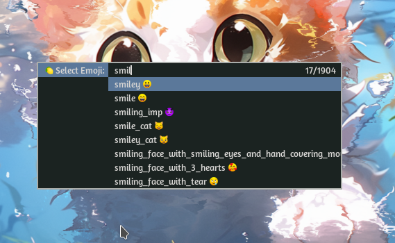

# 🍋 Xmoji - Emoji Selector Script

Xmoji is a simple shell script that allows you to select and copy emoji characters to your clipboard using dmenu.



## Installation

Use the following steps to install Xmoji in your local machine.

```bash
git clone https://github.com/EnigmaticJihad/xmoji.git
cd xmoji
chmod +x xmoji
sudo mv /usr/local/bin/
cd .. && rm -rf xmoji
```

## Usage

- Simply run `xmoji` to start selecting and copying emojis to your clipboard.
- Use a keybinding like `Mod + e` to run the script.

## License

This project is licensed under the MIT License - see the [LICENSE](LICENSE) file for details.
